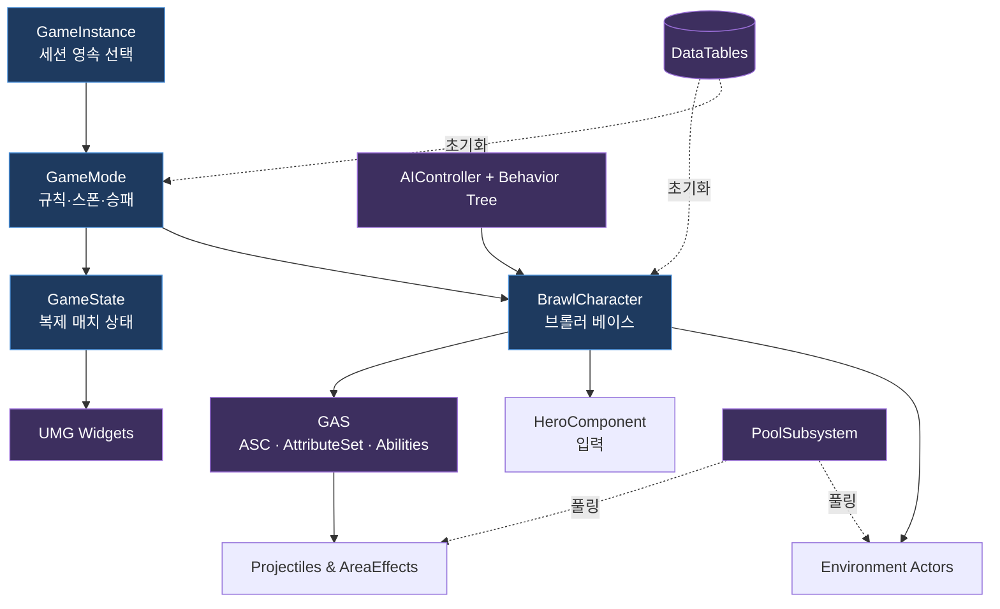

# BrawlStarsTPS — 클래스 다이어그램

브롤스타즈 풍의 3인칭 TPS 프로젝트(`Source/BrawlStarsTPS/`, 약 90개 C++ 클래스)의 구조를 기능 단위로 분할한 클래스 다이어그램 모음입니다. 모든 다이어그램은 [Mermaid](https://mermaid.js.org/) 형식으로, GitHub·VS Code(Markdown Preview Mermaid Support 등)에서 바로 렌더링됩니다.

> 범위: `Brawl*` 네임스페이스의 포트폴리오 코드. Epic TPS 템플릿 변형(`Variant_*`)은 제외합니다.

---

## 아키텍처 개요

---

## 문서 목록

| # | 문서 | 다루는 범위 |
|---|------|------------|
| 1 | [Core Framework](01_CoreFramework.md) | GameMode / GameState / PlayerState / GameInstance / BrawlCharacter / PawnComponent / PoolSubsystem |
| 2 | [GAS & Abilities](02_GAS_Abilities.md) | AbilitySystemComponent / AttributeSet / GameplayAbility 계층 / AreaEffect / CueManager |
| 3 | [AI](03_AI.md) | AIController / 전략 Enum / Behavior Tree Task·Decorator·Service |
| 4 | [Components & Input](04_Components_Input.md) | HeroComponent / InputConfig / InputComponent / MatchFlowComponent |
| 5 | [UI](05_UI.md) | UserWidget 베이스 / HUD / 스킬 게이지 / 로비·메뉴·결과 화면 |
| 6 | [Environment & Projectiles](06_Environment_Projectiles.md) | Obstacle / Bush / PoisonZone / PowerCube / Projectile 계층 |
| 7 | [Data & Types](07_Data_Index.md) | DataTable 행 구조체 / Enum / BrawlerPreview |

---

## 설계 키워드

- **GAS (Gameplay Ability System)** — 체력·탄약·슈퍼·하이퍼·가젯을 모두 GameplayAttribute로, 행동을 GameplayAbility로 모델링. 코스트(`CheckCost`/`ApplyCost`)와 데미지를 GameplayEffect로 처리.
- **데이터 주도 설계** — 브롤러 스탯·AI 파라미터·게임 모드·맵을 DataTable(`FTableRowBase`)로 외부화.
- **오브젝트 풀링** — `IBrawlPoolableInterface` + `UBrawlPoolSubsystem`으로 발사체·환경 액터의 GC 비용 절감.
- **컴포지션(Lyra식)** — `UBrawlPawnComponent`/`UBrawlHeroComponent`로 입력·기능을 캐릭터에서 분리.
- **전략 기반 AI** — Behavior Tree + Blackboard, `BTS_EvaluateStrategy`가 `EBrawlAIStrategy`를 산출해 분기.
- **인터페이스 추상화** — `IAbilitySystemInterface`, `IGenericTeamAgentInterface`(팀/적아 구분), `IBrawlDestructibleInterface`, `IBrawlPoolableInterface`.

---

## 표기 규약

- `<|--` 상속(generalization), `<|..` 인터페이스 구현, `*--` 컴포지션(소유), `..>` 의존.
- 멤버는 가독성을 위해 **대표 항목만** 발췌했습니다. 전체 시그니처는 해당 헤더(`Source/BrawlStarsTPS/Public/...`)를 참조하세요.
- 접근자 표기: `+` public, `#` protected, `-` private.
