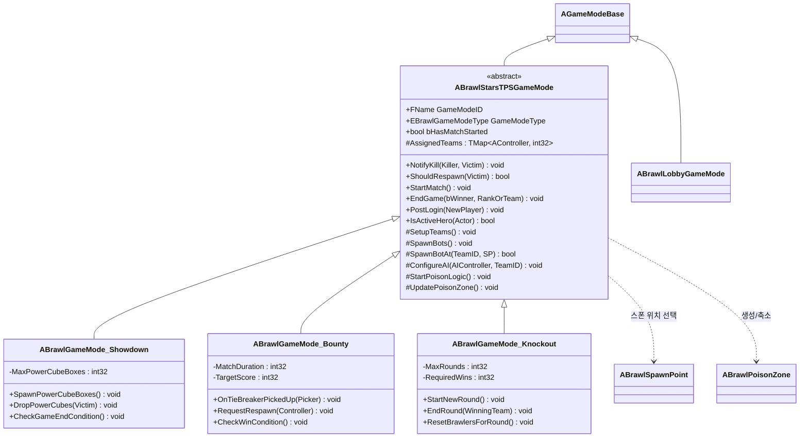
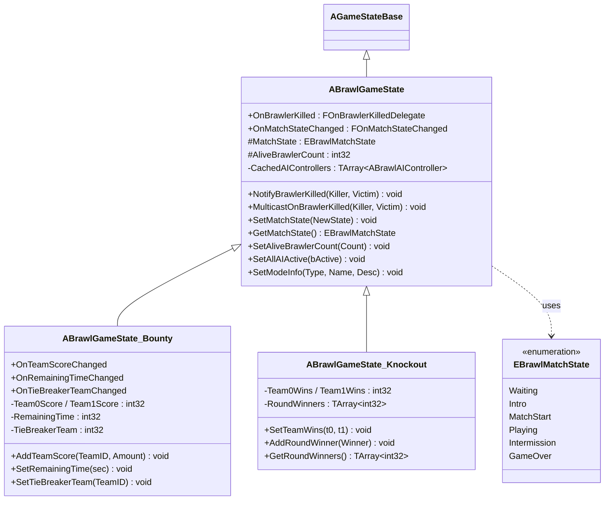
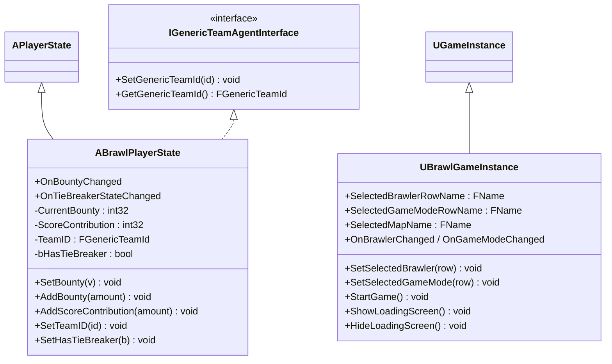
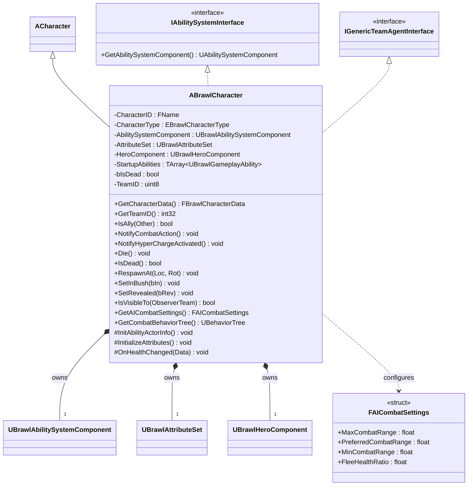
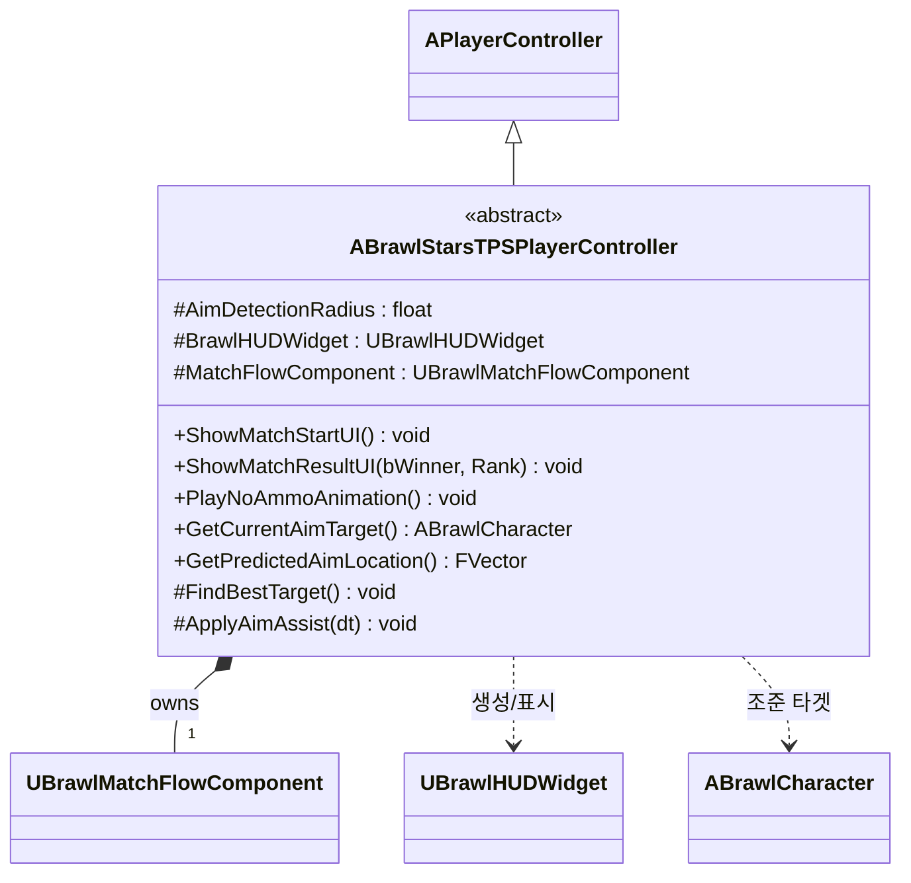
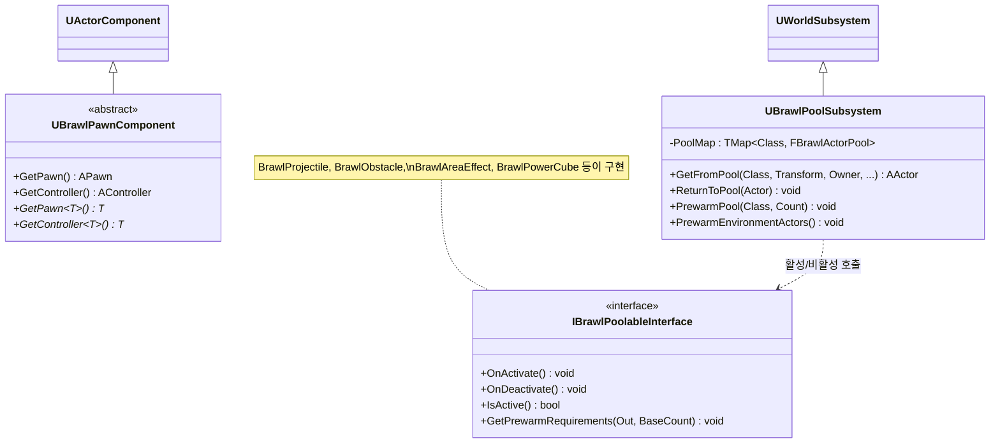

# 클래스 다이어그램 — 1. Core Framework

게임의 뼈대를 이루는 프레임워크 클래스들입니다. 게임 모드(규칙), 게임 상태(공유 상태), 플레이어 상태, 게임 인스턴스(세션 영속), 기본 캐릭터, 그리고 공용 인프라(폰 컴포넌트 베이스 / 오브젝트 풀)를 포함합니다.

> 위치: `Source/BrawlStarsTPS/` (루트) 및 `Source/BrawlStarsTPS/Public/`

---

## 1.1 GameMode 계층 (게임 규칙)

`ABrawlStarsTPSGameMode`(추상)가 모든 모드의 공통 로직(팀 배정, 봇 스폰, 독구름 로직, 처치 알림)을 담고, 각 모드가 이를 특수화합니다.

---

## 1.2 GameState 계층 (복제되는 매치 상태)

`ABrawlGameState`가 매치 상태 머신(`EBrawlMatchState`)과 생존자 수, 처치 전파(Multicast)를 관리합니다. 모드별 서브클래스가 점수/라운드 데이터를 추가하고 UI 바인딩용 델리게이트를 노출합니다.

---

## 1.3 PlayerState / GameInstance (플레이어·세션 상태)

`ABrawlPlayerState`는 팀/현상금/기여도 등 플레이어별 복제 상태를, `UBrawlGameInstance`는 레벨 전환을 넘어서는 선택(브롤러/모드/맵)을 유지합니다.

---

## 1.4 기본 캐릭터 `ABrawlCharacter`

모든 브롤러의 베이스. GAS(`IAbilitySystemInterface`)와 팀 시스템(`IGenericTeamAgentInterface`)을 구현하며, 카메라·체력바·은신(덤불)·독 화면 효과·하이퍼차지 등을 통합합니다. 일부 환경 액터(파워큐브 박스, 가시 식물)도 이를 상속합니다.

---

## 1.5 PlayerController (게임플레이)

`ABrawlStarsTPSPlayerController`(추상)는 인게임 플레이어 컨트롤러로, 입력 매핑·Brawl HUD 생성·매치 흐름 컴포넌트 소유, 그리고 **조준 보조**(가장 가까운 타겟 탐색 + 발사체 예측 보정)를 담당합니다.

> 로비 전용 컨트롤러 `ABrawlLobbyPlayerController`는 [05_UI.md](05_UI.md)에서 다룹니다.

---

## 1.6 공용 인프라 — Pawn 컴포넌트 베이스 & 오브젝트 풀

---

### 관련 모듈
- 캐릭터가 소유하는 GAS 상세 → [02_GAS_Abilities.md](02_GAS_Abilities.md)
- `UBrawlHeroComponent` / 입력 → [04_Components_Input.md](04_Components_Input.md)
- 풀링되는 환경/발사체 액터 → [06_Environment_Projectiles.md](06_Environment_Projectiles.md)
