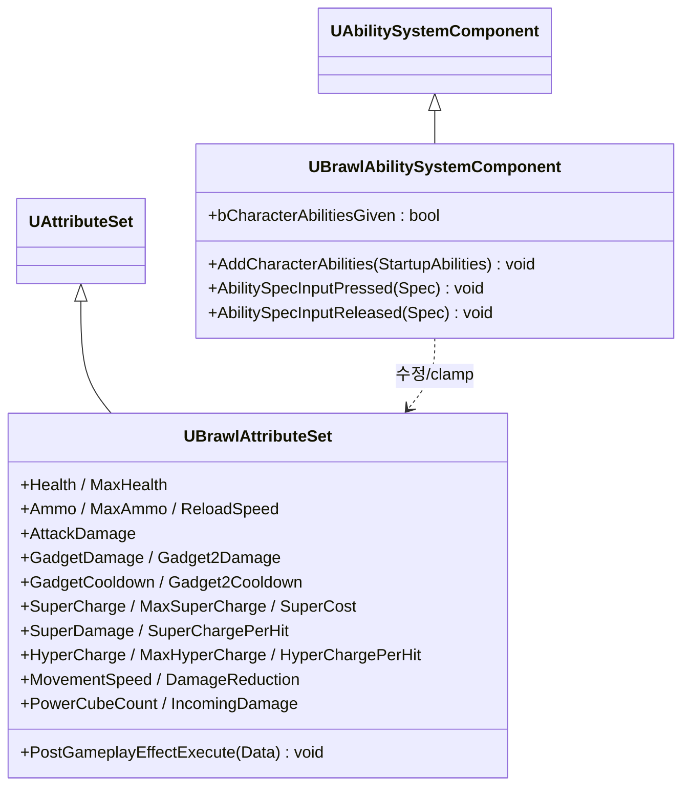
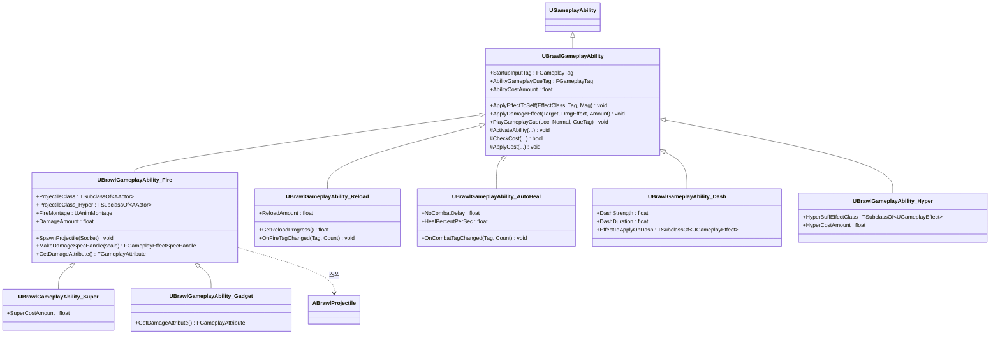
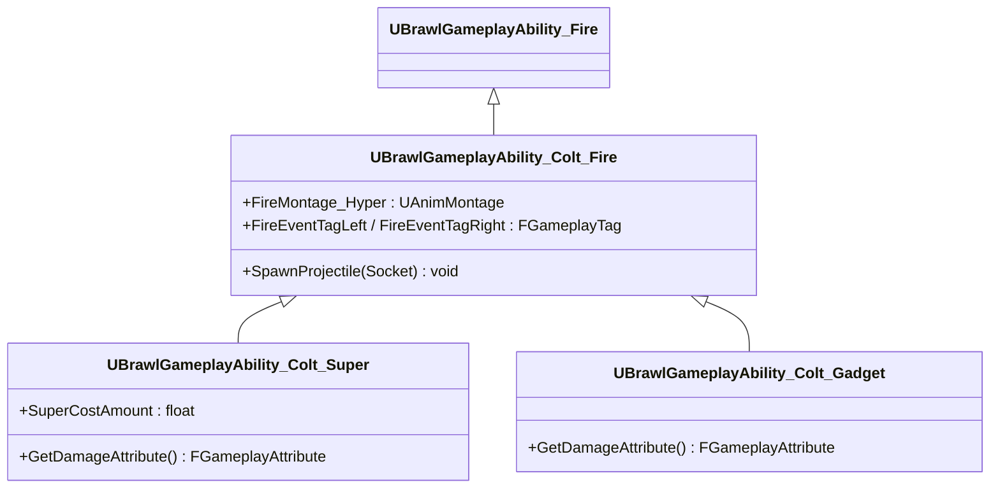
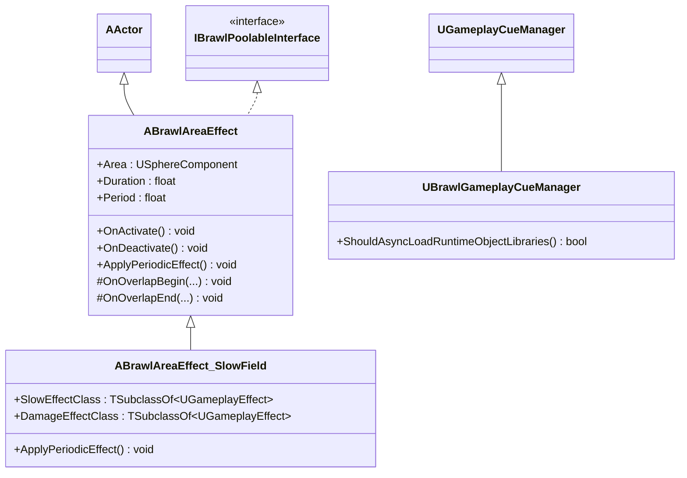

# 클래스 다이어그램 — 2. Gameplay Ability System (GAS)

언리얼의 GAS를 기반으로 한 전투/스킬 시스템입니다. 어빌리티 시스템 컴포넌트(ASC), 속성 집합(AttributeSet), 어빌리티 계층, 그리고 지속 효과 액터(AreaEffect)로 구성됩니다.

> 위치: `Source/BrawlStarsTPS/Public/` 및 `Public/Abilities/`

---

## 2.1 ASC & AttributeSet (속성/입력 코어)

`UBrawlAbilitySystemComponent`는 시작 어빌리티 부여와 입력 태그 → 어빌리티 활성화를 담당하고, `UBrawlAttributeSet`은 체력/탄약/슈퍼/하이퍼 등 모든 게임플레이 수치를 보유합니다.

> 모든 속성은 `ATTRIBUTE_ACCESSORS` 매크로로 Getter/Setter/Init 접근자가 생성됩니다.

---

## 2.2 GameplayAbility 계층 (어빌리티)

`UBrawlGameplayAbility`(베이스)가 데미지/큐/코스트 처리를 제공하고, `UBrawlGameplayAbility_Fire`가 발사체 발사 + 조준 보조의 핵심 로직을 담아 Super/Gadget/Colt 계열의 부모가 됩니다. 코스트는 `SuperCharge`/`HyperCharge`/`GadgetCooldown` 등 속성을 소모하도록 `CheckCost`/`ApplyCost`를 오버라이드합니다.

---

## 2.3 브롤러별 특수화 — Colt 계열

브롤러(Colt)는 `_Fire`를 상속해 좌/우 교차 발사 등을 구현하고, 그 Colt Fire를 다시 Super/Gadget이 상속하는 깊은 계층을 형성합니다. (다른 브롤러 추가 시 동일 패턴 복제)

---

## 2.4 지속 효과 액터 & Cue 매니저

`ABrawlAreaEffect`는 일정 범위에 주기적으로 효과를 적용하는 풀링 가능 액터이며, `UBrawlGameplayCueManager`는 큐 라이브러리 동기 로딩을 커스터마이즈합니다.

---

### 관련 모듈
- ASC/AttributeSet를 소유하는 캐릭터 → [01_CoreFramework.md](01_CoreFramework.md)
- 어빌리티가 스폰하는 발사체 → [06_Environment_Projectiles.md](06_Environment_Projectiles.md)
- 스킬 충전/쿨다운 표시 UI → [05_UI.md](05_UI.md)
