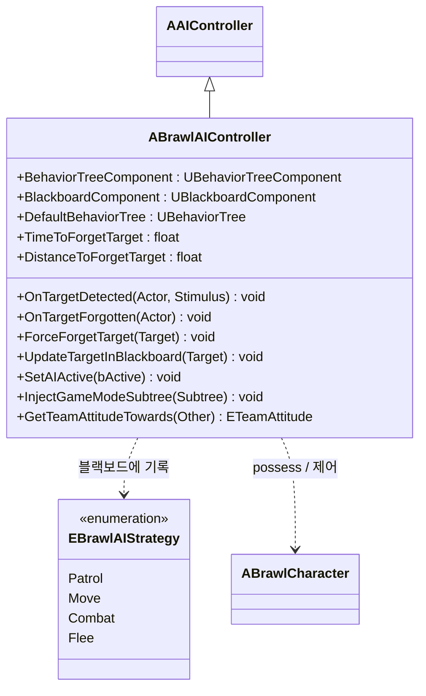
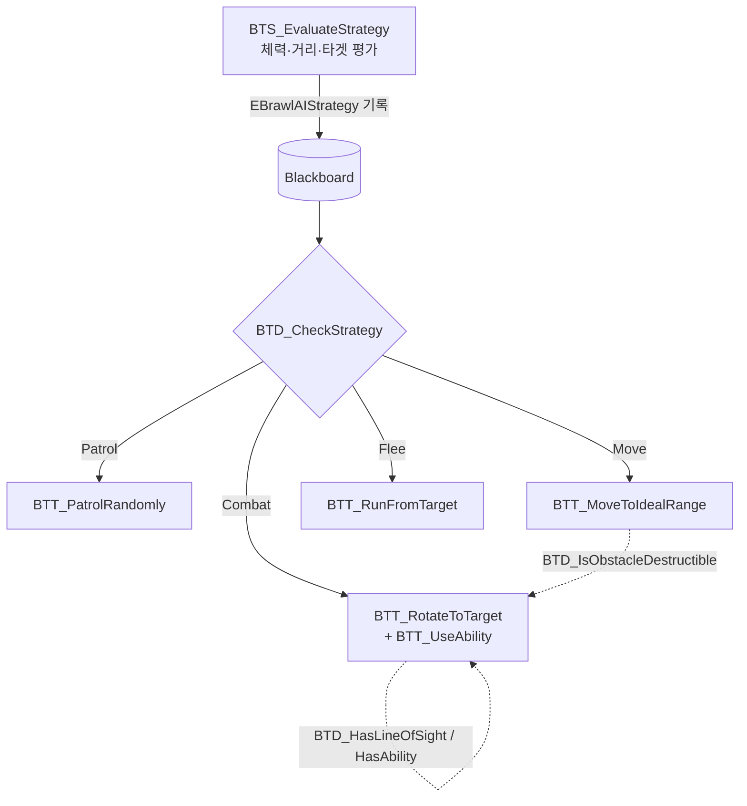

# 클래스 다이어그램 — 3. AI (Behavior Tree)

AI 브롤러를 구동하는 컨트롤러와 Behavior Tree 노드(Task / Decorator / Service)들입니다. 핵심 아이디어는 `BTS_EvaluateStrategy`가 상황을 평가해 `EBrawlAIStrategy`(순찰/이동/교전/도주)를 블랙보드에 기록하고, Decorator가 그 전략에 따라 분기하며, Task가 실제 행동을 수행하는 구조입니다.

> 위치: `Source/BrawlStarsTPS/Public/AI/`

---

## 3.1 컨트롤러 & 전략 상태

`ABrawlAIController`는 BehaviorTree/Blackboard 컴포넌트와 AI 인지(Perception, 타겟 감지/망각)를 관리하며, 게임 모드별 서브트리를 주입(`InjectGameModeSubtree`)받습니다.

---

## 3.2 Behavior Tree 노드 계층

언리얼의 BT 기본 노드 타입별로 커스텀 노드를 구현합니다.

```mermaid
classDiagram
    class UBTTaskNode
    class UBTDecorator
    class UBTService

    class UBTT_PatrolRandomly { 무작위 순찰 지점 이동 }
    class UBTT_MoveToIdealRange { 교전 적정 거리로 이동 }
    class UBTT_RunFromTarget { 타겟 반대로 도주 }
    class UBTT_RotateToTarget { 타겟 향해 회전 }
    class UBTT_UseAbility { 어빌리티 사용 }
    class UBTT_Jump { 점프 실행 }
    class UBTT_GetMapCenter { 맵 중심 좌표 산출 }

    class UBTD_CheckStrategy { 현재 전략 일치 검사 }
    class UBTD_HasAbility { 어빌리티 보유/사용 가능 }
    class UBTD_HasLineOfSight { 시야 확보 여부 }
    class UBTD_HasDetectedItem { 감지된 아이템 존재 }
    class UBTD_IsNeedToJump { 점프 필요 상황 }
    class UBTD_IsObstacleDestructible { 장애물 파괴 가능 }

    class UBTS_EvaluateStrategy { 전략 평가 후 블랙보드 갱신 }
    class UBTS_RotateToTarget { 지속적 타겟 조준 }
    class UBTS_UpdateSelfStatus { 자기 상태(체력 등) 갱신 }

    UBTTaskNode <|-- UBTT_PatrolRandomly
    UBTTaskNode <|-- UBTT_MoveToIdealRange
    UBTTaskNode <|-- UBTT_RunFromTarget
    UBTTaskNode <|-- UBTT_RotateToTarget
    UBTTaskNode <|-- UBTT_UseAbility
    UBTTaskNode <|-- UBTT_Jump
    UBTTaskNode <|-- UBTT_GetMapCenter

    UBTDecorator <|-- UBTD_CheckStrategy
    UBTDecorator <|-- UBTD_HasAbility
    UBTDecorator <|-- UBTD_HasLineOfSight
    UBTDecorator <|-- UBTD_HasDetectedItem
    UBTDecorator <|-- UBTD_IsNeedToJump
    UBTDecorator <|-- UBTD_IsObstacleDestructible

    UBTService <|-- UBTS_EvaluateStrategy
    UBTService <|-- UBTS_RotateToTarget
    UBTService <|-- UBTS_UpdateSelfStatus
```

---

## 3.3 전략 기반 의사결정 흐름

---

### 관련 모듈
- AI가 사용하는 어빌리티 → [02_GAS_Abilities.md](02_GAS_Abilities.md)
- 전투 파라미터(`FAICombatSettings`)를 제공하는 캐릭터 → [01_CoreFramework.md](01_CoreFramework.md)
- AI 튜닝 데이터(`FBrawlAIData`) → [07_Data_Index.md](07_Data_Index.md)
