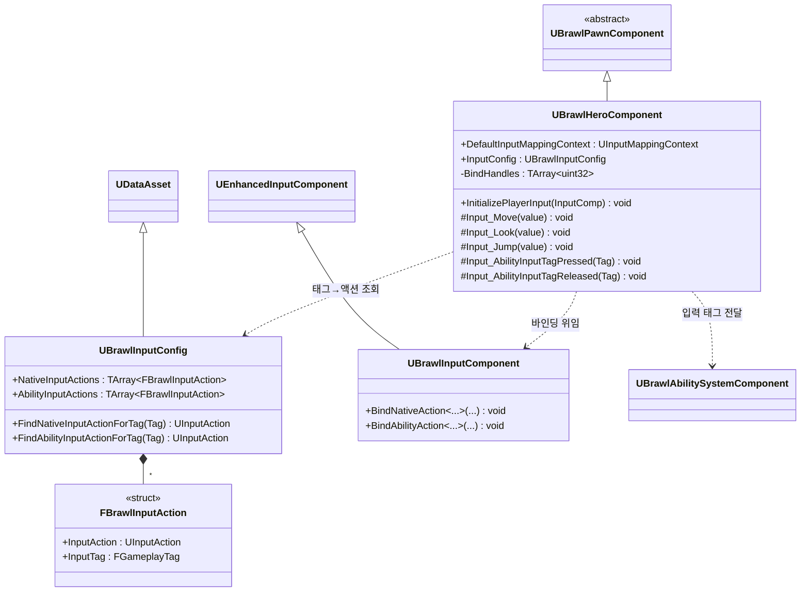
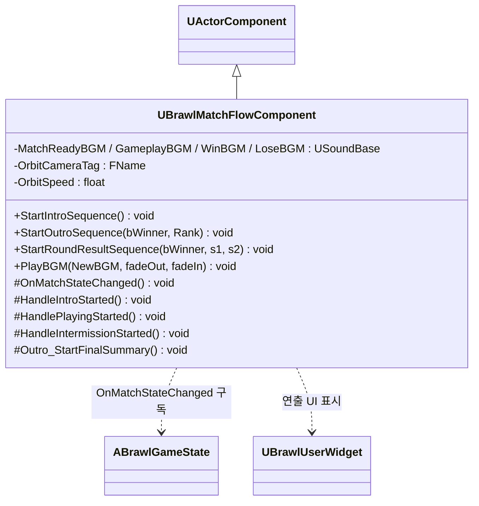

# 클래스 다이어그램 — 4. Components & Input

플레이어 입력(Lyra식 Enhanced Input + Gameplay Tag 매핑)과 매치 연출 흐름을 담당하는 컴포넌트들입니다.

> 위치: `Source/BrawlStarsTPS/Public/Components/` 및 `Public/Input/`

---

## 4.1 입력 시스템 (Enhanced Input + Gameplay Tag)

`UBrawlInputConfig`(데이터 에셋)가 InputAction ↔ GameplayTag 매핑 테이블을 들고 있고, `UBrawlInputComponent`가 그 매핑으로 네이티브/어빌리티 액션을 바인딩합니다. `UBrawlHeroComponent`가 이 둘을 묶어 실제 입력 콜백을 캐릭터/ASC로 전달합니다.

---

## 4.2 매치 흐름 컴포넌트

`UBrawlMatchFlowComponent`는 PlayerController에 부착되어 `EBrawlMatchState` 변화에 반응, 인트로/시작/플레이/결과 연출과 BGM 전환·궤도 카메라를 제어합니다.

---

### 관련 모듈
- HeroComponent를 소유하는 캐릭터, MatchFlow를 소유하는 PlayerController → [01_CoreFramework.md](01_CoreFramework.md)
- 입력 태그로 활성화되는 어빌리티 → [02_GAS_Abilities.md](02_GAS_Abilities.md)
- 연출에 사용되는 위젯들 → [05_UI.md](05_UI.md)
