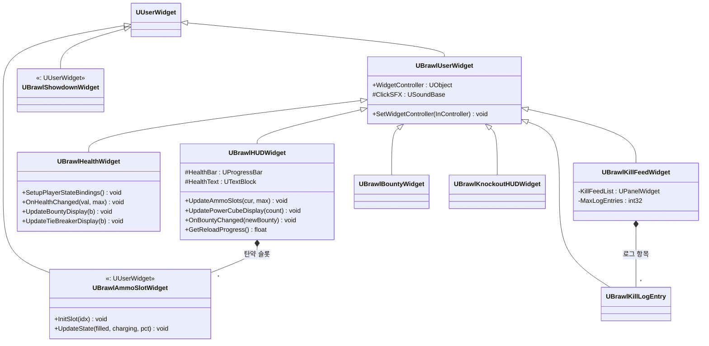
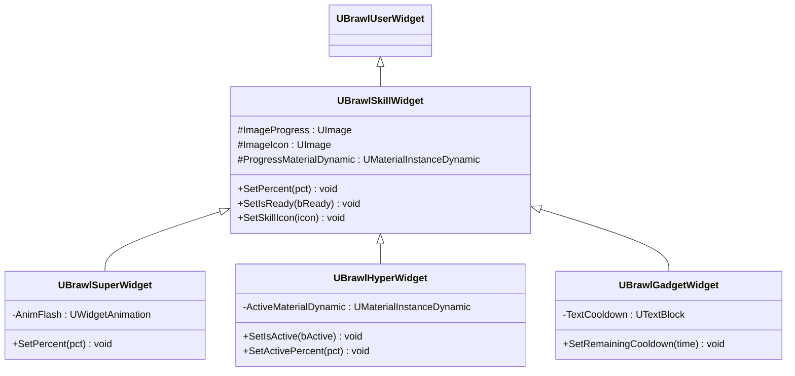
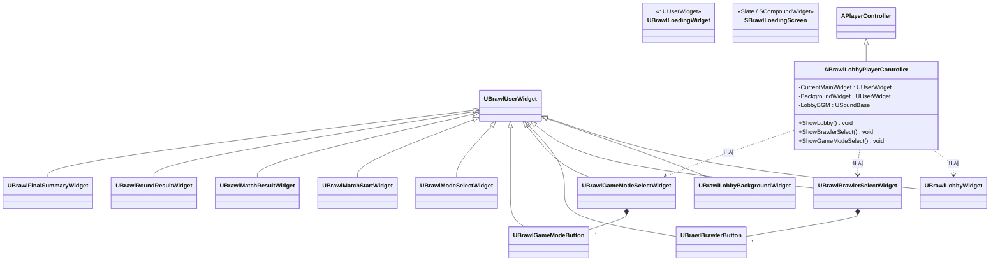

# 클래스 다이어그램 — 5. UI (UMG Widgets)

UMG 위젯 계층입니다. 거의 모든 위젯이 `UBrawlUserWidget`(WidgetController 패턴 + 공통 클릭 SFX)을 상속하며, 인게임 HUD / 스킬 게이지 / 로비·메뉴 흐름으로 나뉩니다.

> 위치: `Source/BrawlStarsTPS/Public/UI/`

---

## 5.1 위젯 베이스 & 인게임 HUD

---

## 5.2 스킬 게이지 위젯 (Super / Hyper / Gadget)

`UBrawlSkillWidget`이 충전률(`SetPercent`)·준비 상태(`SetIsReady`)·아이콘의 공통 인터페이스를 제공하고, 각 스킬이 고유 연출(플래시, 쿨다운 텍스트, 활성 게이지)을 추가합니다.

---

## 5.3 로비 · 메뉴 · 결과 화면

로비 플로우는 `ABrawlLobbyPlayerController`가 메인 위젯을 스왑(`ShowLobby` / `ShowBrawlerSelect` / `ShowGameModeSelect`)하며 구동합니다. 선택 화면은 버튼 위젯(`*Button`)을 동적으로 채웁니다.

> `UBrawlLoadingWidget`(UMG)과 `SBrawlLoadingScreen`(Slate)은 레벨 전환 로딩 화면용으로, `UBrawlGameInstance`가 표시/숨김을 제어합니다.

---

### 관련 모듈
- 위젯이 구독하는 상태(체력/현상금/매치 상태) → [01_CoreFramework.md](01_CoreFramework.md)
- 스킬 위젯이 반영하는 충전 속성 → [02_GAS_Abilities.md](02_GAS_Abilities.md)
- 연출 시퀀스를 트리거하는 MatchFlow → [04_Components_Input.md](04_Components_Input.md)
