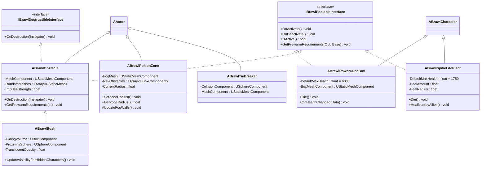
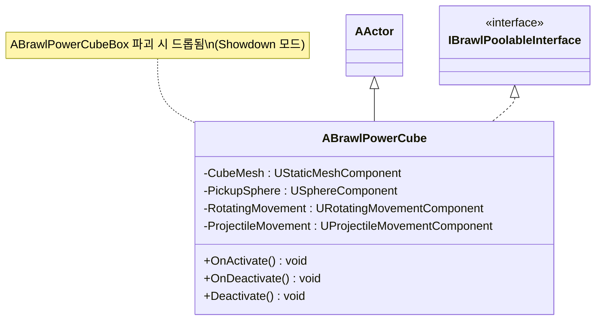
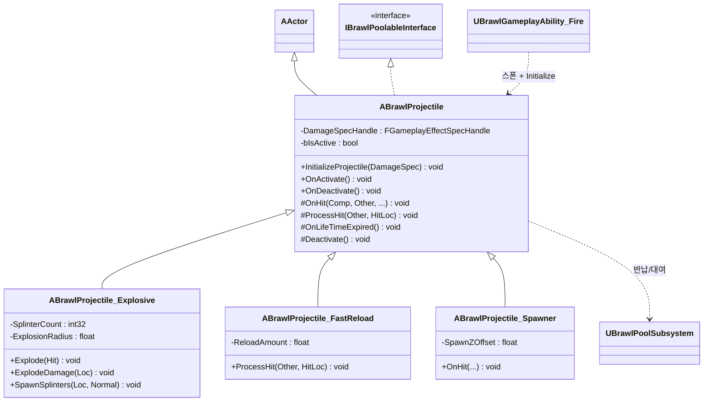

# 클래스 다이어그램 — 6. Environment & Projectiles

월드에 배치되거나 런타임에 스폰되는 액터들입니다. 두 개의 공통 인터페이스(`IBrawlPoolableInterface` 풀링, `IBrawlDestructibleInterface` 파괴)와 발사체 계층이 핵심입니다.

> 위치: `Source/BrawlStarsTPS/Public/Environment/`, `Public/Projectiles/`, `Public/BrawlProjectile.h`

---

## 6.1 환경 액터 계층

장애물(`ABrawlObstacle`)은 파괴+풀링 인터페이스를 모두 구현하고, 덤불(`ABrawlBush`)이 이를 상속해 은신 로직을 추가합니다. 흥미롭게도 파워큐브 박스·가시 식물은 체력/사망 로직을 재사용하기 위해 `ABrawlCharacter`를 상속합니다.

---

## 6.2 픽업/수집 액터

파워큐브는 풀링 가능한 픽업 액터로, 발사 운동(`UProjectileMovementComponent`)으로 튀어나온 뒤 수집됩니다.

---

## 6.3 발사체 계층

`ABrawlProjectile`은 풀링 가능한 발사체 베이스로, GAS 데미지 스펙(`FGameplayEffectSpecHandle`)을 들고 충돌 시 적용합니다. 서브클래스가 폭발·파편·빠른 재장전·추가 스폰 등을 구현합니다.

---

### 관련 모듈
- 풀링 서브시스템·캐릭터 베이스 → [01_CoreFramework.md](01_CoreFramework.md)
- 발사체를 스폰하는 Fire 어빌리티, 데미지 효과 → [02_GAS_Abilities.md](02_GAS_Abilities.md)
- 장애물 파괴 가능 여부를 판단하는 AI 데코레이터 → [03_AI.md](03_AI.md)
