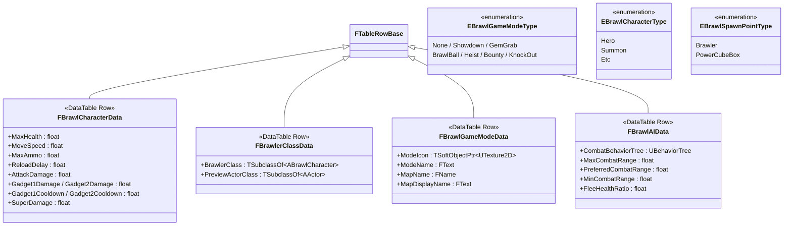
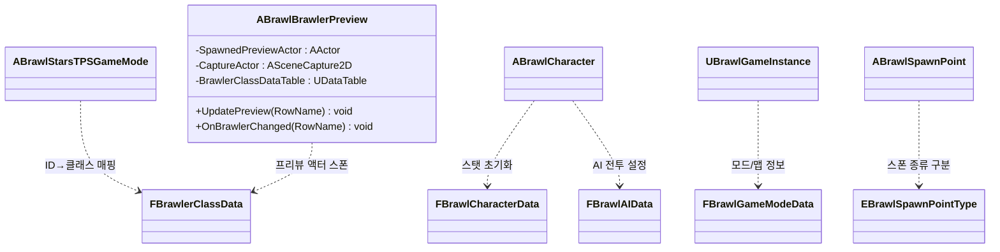

# 클래스 다이어그램 — 7. Data & Types

데이터 주도 설계의 기반인 DataTable 행 구조체(`FTableRowBase` 상속), 공용 Enum, 그리고 데이터 테이블을 소비하는 브롤러 미리보기 액터입니다.

> 위치: `Source/BrawlStarsTPS/Public/Data/`, `Public/BrawlBrawlerPreview.h`

---

## 7.1 DataTable 행 구조체 & Enum

---

## 7.2 데이터 소비 관계

각 데이터 테이블이 어느 클래스에서 사용되는지 보여줍니다.

---

### 관련 모듈
- 데이터로 초기화되는 캐릭터·게임모드·게임인스턴스 → [01_CoreFramework.md](01_CoreFramework.md)
- `FBrawlAIData`를 사용하는 AI → [03_AI.md](03_AI.md)
