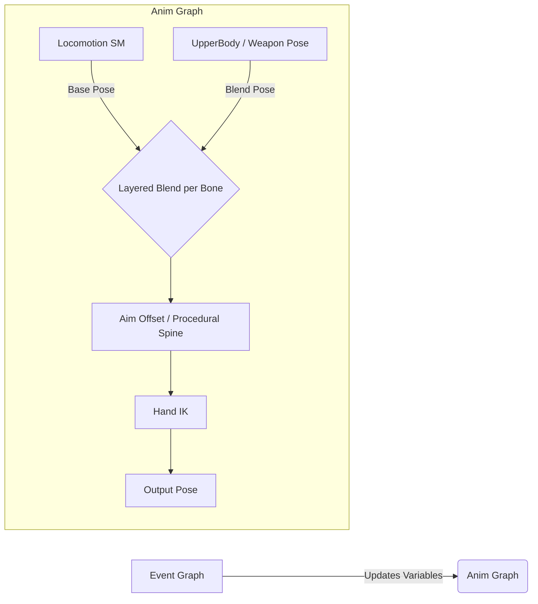

# Animation Implementation Template: Brawler (TPS Layered)

This document outlines the standardized Animation Blueprint (`ABP_[BrawlerName]`) architecture for all Brawlers, focusing on TPS mechanics: layered upper body actions, procedural aiming, and IK hand placement.

## 1. Requirements
1.  **Locomotion:** Smooth transitions between Idle, Walk, Run, and Jump based on archetype (e.g., Tank vs Speedster).
2.  **Layered Upper Body:** Perform actions (Shooting, Reloading, Super) while moving.
3.  **Aim Offset:** Upper body rotates to look at the player's aim target (Pitch/Yaw).
4.  **Hand IK:** Off-hand (Left Hand) precisely attaches to the weapon grip (if applicable).

## 2. Architecture Overview (`ABP_[BrawlerName]`)

## 3. Implementation Details

### A. Event Graph (Variables)
Update these variables every frame in `BlueprintUpdateAnimation`:

*   **`GroundSpeed` (Float):** `Velocity.Length2D`. Controls Locomotion blending.
*   **`IsInAir` (Bool):** `MovementComponent.IsFalling`. Triggers Jump state.
*   **`AimPitch` (Float):** Normalized delta between `ControlRotation` and `ActorRotation`. (-90 to +90). Used for spine bending.
*   **`AimYaw` (Float):** (Optional) For twisting the spine sideways beyond actor rotation.
*   **`LeftHandTransform` (Transform):** (Optional) World/Component space transform for the off-hand, driven by Weapon Socket.

### B. Anim Graph Logic

#### Step 1: Locomotion (Base Layer)
*   **Node:** State Machine (`Locomotion_SM`)
*   **States:**
    *   `Idle/Run`: Uses **Blend Space 2D (`BS_[Name]_Locomotion`)** for TPS Strafe support.
        *   **Vertical Axis (Y):** `ForwardSpeed` (-MaxSpeed to +MaxSpeed).
        *   **Horizontal Axis (X):** `RightSpeed` (-MaxSpeed to +MaxSpeed).
        *   **Setup:** Place animations for Forward, Backward, Left, Right, and Diagonals. Use `Idle` at (0,0).
    *   `Jump_Start` / `Jump_Loop` / `Jump_End`: Transition based on `IsInAir`.

#### Step 1.1: Velocity Calculation (Event Graph)
To drive Blend Space 2D, calculate relative velocity:
1.  **Get Velocity** and **Get Actor Rotation**.
2.  Use **Unrotate Vector** (V: Velocity, Rotation: Actor Rotation).
3.  Store Result X as **`ForwardSpeed`** and Y as **`RightSpeed`**.

#### Step 2: Layered Upper Body
*   **Node:** `Layered blend per bone`
*   **Settings:**
    *   **Bone Name:** `spine_01` (or archetype specific spine bone).
    *   **Blend Depth:** 1 (Smooth blend).
    *   **Mesh Space Rotation Blend:** True.
*   **Inputs:**
    *   **Base Pose:** Cached `Locomotion_SM`.
    *   **Blend Pose 0:** `Weapon_Pose_SM` or specific Montage slot (`UpperBodySlot`).
        *   *Default:* Use an "Aim Idle" sequence loop specific to the Brawler's weapon (Dual pistols, Shotgun, etc.).

#### Step 3: Aim Offset (Procedural Aiming)
*   **Option A (Asset Based):** `Aim Offset` node using `AO_[Name]` (requires specific poses: Center, Up, Down).
*   **Option B (Procedural):** `Transform (Modify) Bone` nodes.
    *   **Bone:** `spine_01` / `spine_02`.
    *   **Rotation:** Add `AimPitch` to the Pitch axis.
    *   **Space:** Component Space.

#### Step 4: Hand IK (Weapon Specific)
*   **Node:** `Two Bone IK` (Off-Hand)
*   **Effector:** Off-hand bone (e.g., `hand_l`).
*   **Target:**
    *   Static Offset: Relative to `hand_r`.
    *   Dynamic: Weapon Socket (`LeftHandSocket` on the Gun mesh).
*   **Joint Target:** Elbow bone (e.g., `lowerarm_l`).

## 4. Asset Requirements (Per Brawler)
*   **Base:** `Idle`, `Run_Fwd`, `Jump_Start`, `Jump_Loop`, `Jump_End`.
*   **Combat:** `Idle_Aim` (Weapon Stance), `Fire`, `Reload`, `Super_Ability`.
*   **Aim Offset (Optional):** `Aim_Center`, `Aim_Up`, `Aim_Down` (or use procedural fallback).

## 5. Action Plan (Checklist)
1.  **Retargeting:** Ensure all required assets are retargeted to `BS_[Name]_Skeleton`.
2.  **Blend Space:** Create `BS_[Name]_Locomotion`.
3.  **ABP Setup:** Create `ABP_[Name]` and implement **Step 1 & Step 2** first.
4.  **Refinement:** Implement **Aim Offset** and **IK** iteratively based on weapon type.
