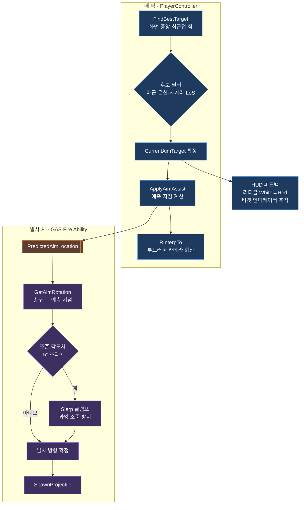

# 어시스트형 자동 조준 (Advanced Aim Assist)

> 포트폴리오 소개용 2슬라이드. 관련 코드: [`BrawlStarsTPSPlayerController.cpp`](../Source/BrawlStarsTPS/BrawlStarsTPSPlayerController.cpp) · [`BrawlGameplayAbility_Fire.cpp`](../Source/BrawlStarsTPS/Private/Abilities/BrawlGameplayAbility_Fire.cpp)

---

## Slide 1 · 개요

### 무엇을 만들었나
TPS 시점에서 **브롤스타즈식 캐주얼 조준감**을 재현한 보조형(assist) 자동 조준.
화면 중앙의 적을 자동으로 포착하고, 움직이는 표적의 **미래 위치를 예측**해 조준을 보정한다.

### 왜 필요했나
- 3인칭 슈터의 정밀 조준 난이도를 낮춰 **누구나 손쉽게 명중** 가능
- 완전 자동조준(aimbot)이 아닌 **플레이어 의도를 존중하는 보조** — 조작감과 자동화의 균형

### 핵심 3요소
| 단계 | 기능 | 구현 포인트 |
|------|------|------------|
| ① 탐지 | **화면 중앙 기준 타겟 선정** | 리티클과의 픽셀 거리 최소 적 선택 (DPI 보정), 아군·은신·사거리·시야(LoS) 필터 |
| ② 예측 | **선형 예측 사격** | `탄착시간 = 거리 / 발사체속도` → `예측지점 = 표적위치 + 표적속도 × 탄착시간` |
| ③ 보정 | **부드러운 자동 회전 + 각도 제한** | `RInterpTo`로 카메라를 서서히 정렬, 발사 시 최대 5° 이내로 `Slerp` 클램프 |

### 설계 원칙 — 관심사 분리
- **조준 계산은 `PlayerController`** 가 매 틱 담당 (타겟 탐색 · 예측 · 카메라 회전 · HUD)
- **실제 발사 방향은 GAS `Fire Ability`** 가 총구 기준으로 재계산 → 로직 재사용·테스트 용이
- 화면 시차(shoulder-view) 보정을 위해 회전 기준점을 액터가 아닌 **카메라 POV**로 계산

---

## Slide 2 · 동작 파이프라인

### 디테일 & 트러블슈팅
- **예측 사격(리드샷)**: 정지 표적뿐 아니라 이동 중인 적도 속도 벡터로 미래 위치를 계산해 명중률 향상
- **각도 클램프(5°)**: 조준 방향이 카메라 정면에서 크게 벗어나면 `Slerp`로 제한 → "화면이 홱 돌아가는" 이질감 제거, 수동 조준 의도 보존
- **시차 보정**: 회전 기준을 카메라 위치로 잡아 오버숄더 시점에서도 표적이 **리티클 정중앙**에 유지
- **근거리 바닥 조준 방지**: 700 유닛 이내에서 조준점을 점진적으로 위로 올려 발밑을 겨누는 현상 제거
- **멀미 방지**: 컨트롤 회전의 `Roll`을 0으로 고정해 화면 기울어짐 차단
- **HUD 연동**: 타겟 포착 시 리티클 색상 전환 + 표적을 따라다니는 인디케이터 위젯(DPI 스케일 보정)

### 사용 기술
`GAS (GameplayAbility)` · `Enhanced Input` · `Linear Prediction` · `RInterpTo / Quat Slerp` · `LineTrace(LoS)` · `UMG HUD`
