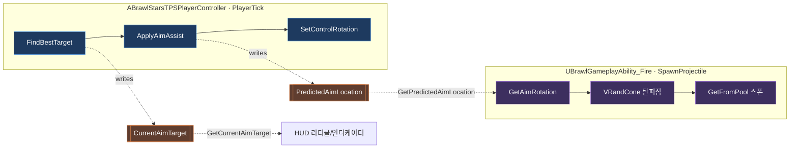

# 자동 조준 (Aim Assist) — 기술 문서

TPS 시점에서 화면 중앙 기준으로 적을 포착하고, 이동 표적의 예측 위치를 향해 조준을 보정하는 보조형 자동 조준 시스템. 조준 **계산**과 발사체 **발사 방향 결정**을 분리해 구현한다.

- **탐지·예측·회전**: [`ABrawlStarsTPSPlayerController`](../Source/BrawlStarsTPS/BrawlStarsTPSPlayerController.cpp) (매 틱, 로컬 플레이어)
- **발사 방향 산출**: [`UBrawlGameplayAbility_Fire::GetAimRotation`](../Source/BrawlStarsTPS/Private/Abilities/BrawlGameplayAbility_Fire.cpp) (발사 시)

---

## 1. 아키텍처



`PlayerController`는 매 틱 상태(`CurrentAimTarget`, `PredictedAimLocation`)를 갱신하고, `Fire` 어빌리티는 발사 시점에 이 상태를 조회(pull)해 최종 발사 회전을 계산한다. 두 모듈은 게터(`GetPredictedAimLocation` / `GetCurrentAimTarget`)로만 결합된다.

---

## 2. 타겟 탐지 — `FindBestTarget()`

화면 중앙(리티클)에 **스크린 공간상 가장 가까운** 유효 적을 선정한다.

```cpp
// 최대 사거리 = 발사체 속도 × 수명
float MaxWorldRange = MyChar->GetEstimatedProjectileSpeed() * MyChar->GetEstimatedProjectileLifetime();

// 탐지 반경(픽셀)에 DPI 스케일 보정
float ScaledAimRadius = AimDetectionRadius * UWidgetLayoutLibrary::GetViewportScale(this);
float BestDistSq = FMath::Square(ScaledAimRadius);
```

후보는 `TActorIterator<ABrawlCharacter>`로 순회하며 아래 조건을 **모두** 통과해야 한다.

| 필터 | 조건 | 판별 |
|------|------|------|
| 자기 자신 / 사망 | 제외 | `OtherChar == MyChar`, `IsDead()` |
| 아군 | 제외 | `MyChar->IsAlly(OtherChar)` (소환사·팀 ID 포함) |
| 은신 / 시야 | 보이지 않으면 제외 | `IsVisibleTo(GetGenericTeamId())` |
| 사거리 | `MaxWorldRange` 초과 제외 | `DistSquared` 비교 |
| 장애물(LoS) | 벽 뒤면 제외 | `LineTraceSingleByChannel(ECC_Visibility)` |
| 화면 밖 | 투영 실패 제외 | `ProjectWorldLocationToScreen` |

통과한 적 중 스크린 중앙과의 `DistSquared`가 최소인 대상을 `CurrentAimTarget`으로 확정한다. `AimDetectionRadius`는 매 틱 HUD의 `ReticleCircleRadius × 1.25`로 동기화된다.

---

## 3. 예측 사격 & 회전 — `ApplyAimAssist(DeltaTime)`

### 3.1 유효성 재검증
발사 유지 중 표적이 사망/이탈/엄폐했는지 매 틱 확인하고, 실패 시 `CurrentAimTarget`·`PredictedAimLocation`을 리셋한다.
- 사망 또는 `DistToTarget > MaxWorldRange`
- 표적과의 사이에 `ECC_Visibility` 장애물 존재

### 3.2 선형 예측 (Linear Prediction)
```cpp
float TimeToHit = (ProjectileSpeed > 0.f) ? (DistToTarget / ProjectileSpeed) : 0.f;
PredictedAimLocation = TargetLoc + (TargetVel * TimeToHit);   // 리드샷
```
표적 속도 벡터(`GetVelocity()`)를 탄착 시간만큼 외삽해 미래 위치를 조준한다.

### 3.3 회전 산출 및 보간
```cpp
// 기준점을 액터가 아닌 카메라 위치로 → 오버숄더 시차 보정 (리티클 정중앙 유지)
FRotator LookAtRot = FindLookAtRotation(CameraLoc, CameraTargetLoc);
FRotator NewRot   = FMath::RInterpTo(GetControlRotation(), LookAtRot, DeltaTime, AimAssistInterpSpeed);
NewRot.Roll = 0.0f;               // 화면 기울어짐(멀미) 방지
SetControlRotation(NewRot);
```

**근거리 바닥 조준 보정**: `DistToTarget < 700`일 때 카메라용 조준점 Z를 상향한다(발사체용 `PredictedAimLocation`과는 분리).
```cpp
float VerticalOffset = FMath::GetMappedRangeValueClamped(
    FVector2D(200.f, 700.f), FVector2D(80.f, 0.f), DistToTarget);
CameraTargetLoc.Z += VerticalOffset;
```

---

## 4. 발사 방향 결정 — `GetAimRotation(StartLocation)`

`SpawnProjectile()`가 총구 위치를 인자로 호출. 발사 방향은 **컨트롤러 회전이 아니라 총구→예측지점** 기준으로 재계산되어 발사체가 화면과 일치한다.

```cpp
FVector PredictedLoc = PC->GetPredictedAimLocation();
if (!PredictedLoc.IsZero())
{
    FRotator TargetRot = FindLookAtRotation(StartLocation, PredictedLoc);

    // 각도 클램프: 컨트롤러 정면과 조준 방향의 차이 계산
    float AngleDiff = RadiansToDegrees(Acos(DotProduct(ControllerForward, TargetRot.Vector())));
    const float MaxAutoAimAngle = 5.0f;
    if (AngleDiff > MaxAutoAimAngle)
    {
        float Alpha = MaxAutoAimAngle / AngleDiff;
        FQuat ClampedQuat = FQuat::Slerp(ControllerForward.ToOrientationQuat(),
                                         TargetRot.Quaternion(), Alpha);
        return ClampedQuat.Rotator();   // 정면에서 최대 5°까지만 보정
    }
    return TargetRot;
}
// 타겟 없음: 카메라 전방(화면 중앙)으로 수동 발사
return FindLookAtRotation(StartLocation, CameraLoc + CameraForward * AimMaxRange);
```

**각도 클램프의 의미**: 자동 조준을 정면 ±5° 이내로 제한해 완전 자동조준(aimbot)이 아닌 보조로 동작하게 하고, 급격한 방향 전환에 의한 이질감을 제거한다. AI 브롤러는 이 경로를 타지 않고 컨트롤 회전값을 그대로 사용한다.

---

## 5. HUD 피드백

`PlayerTick`에서 `CurrentAimTarget` 유무에 따라:
- **리티클**: `ReticleCircle` 색상 `White ↔ Red` 전환
- **타겟 인디케이터**: 표적 월드 위치를 `ProjectWorldLocationToWidgetPosition`으로 위젯 좌표 변환 후 추적(0.5, 0.5 정렬), 투영 실패 시 `Collapsed`

---

## 6. 파라미터

| 프로퍼티 | 위치 | 기본값 | 설명 |
|----------|------|--------|------|
| `AimDetectionRadius` | PlayerController | 100.0 (px) | 탐지 원 반경 (HUD 리티클 × 1.25로 동기화) |
| `AimAssistInterpSpeed` | PlayerController | 7.5 | 카메라 자동 회전 보간 속도 |
| `MaxAutoAimAngle` | Fire Ability (상수) | 5.0° | 자동 조준 최대 허용 각도 |
| `AimMinRange` / `AimMaxRange` | Fire Ability | 700 / 3000 | 에임 트레이스 사거리 |
| `AimTraceRadius` | Fire Ability | 50.0 | 스피어 트레이스 반지름 |

## 7. 관련 API

| 시그니처 | 역할 |
|----------|------|
| `FVector GetPredictedAimLocation() const` | 예측 사격 지점 반환 (Fire 어빌리티가 조회) |
| `ABrawlCharacter* GetCurrentAimTarget() const` | 현재 락온 타겟 반환 |
| `void FindBestTarget()` | 스크린 중앙 최근접 적 선정 |
| `void ApplyAimAssist(float DeltaTime)` | 예측 계산 + 카메라 보간 회전 |
| `FRotator GetAimRotation(FVector StartLocation) const` | 총구 기준 최종 발사 회전 산출 |
