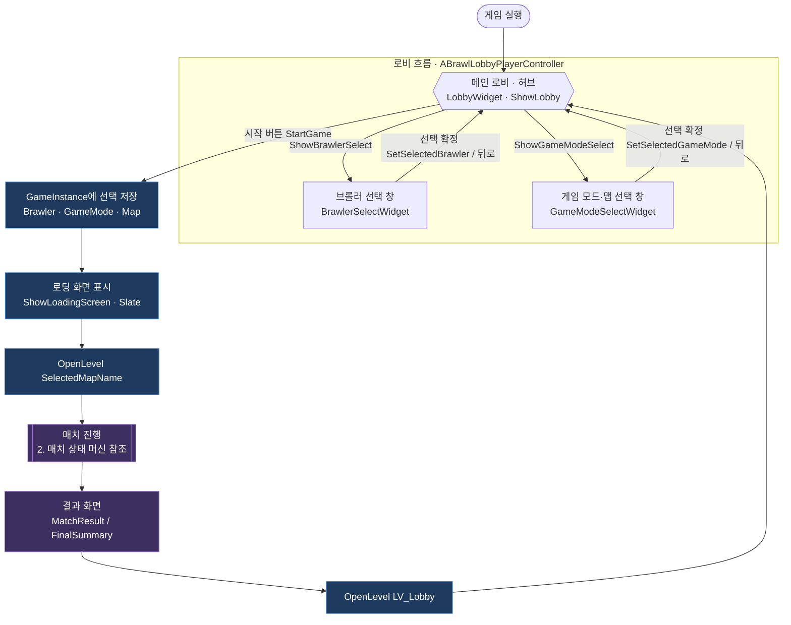
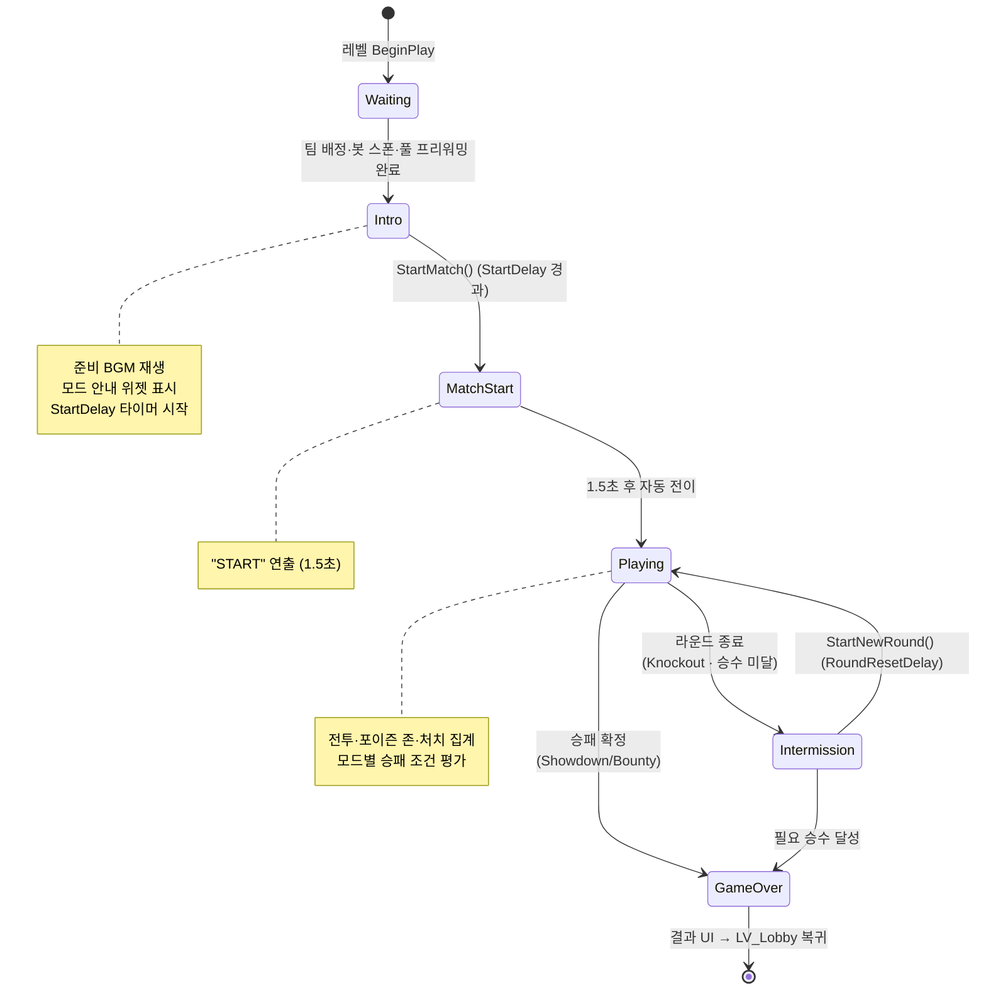
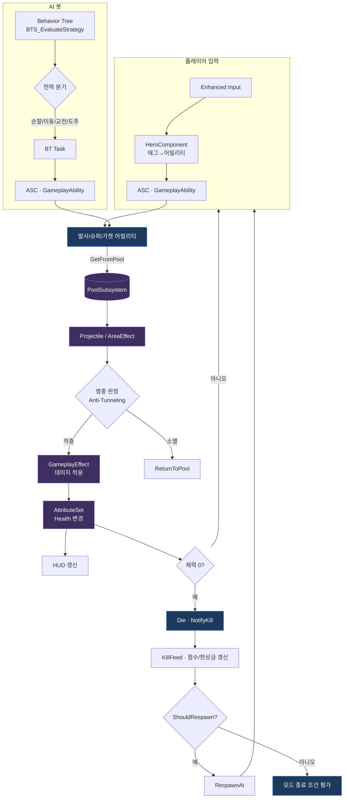

# BrawlStarsTPS — 게임 흐름도

프로젝트의 게임 진행 흐름을 **세션 라이프사이클 → 매치 상태 머신 → 인게임 전투 루프** 세 단계로 정리한 문서입니다. 모든 다이어그램은 [Mermaid](https://mermaid.js.org/) 형식이며 GitHub·VS Code에서 바로 렌더링됩니다.

> 클래스 단위 구조는 [Docs/ClassDiagrams/](ClassDiagrams/00_Overview.md)를, 핵심 파일 경로는 [KEY_FILE_PATHS.md](../KEY_FILE_PATHS.md)를 참고하세요.

---

## 1. 세션 라이프사이클 (로비 → 매치 → 결과 → 로비)

레벨 전환을 가로지르는 큰 흐름입니다. `UBrawlGameInstance`가 선택(브롤러/모드/맵)을 유지하고, 로딩 화면을 거쳐 매치 레벨로 진입한 뒤, 매치 종료 후 다시 로비(`LV_Lobby`)로 복귀합니다.

로비(`ABrawlLobbyPlayerController`)는 **허브** 역할을 합니다. 메인 로비 위젯에서 선택 창으로 진입(`ShowBrawlerSelect` / `ShowGameModeSelect`)했다가, 선택을 확정하거나 뒤로 가면 다시 메인 로비(`ShowLobby`)로 돌아옵니다. 두 선택은 순서가 정해져 있지 않으며, 시작 버튼을 누르면 `StartGame()`이 호출됩니다.

---

## 2. 매치 상태 머신 (`EBrawlMatchState`)

매치 레벨에 진입하면 `ABrawlStarsTPSGameMode`가 `ABrawlGameState`의 상태를 전이시키고, PlayerController에 부착된 `UBrawlMatchFlowComponent`가 그 변화에 반응해 연출·BGM을 재생합니다.

**모드별 종료 분기**

| 모드 | Playing 중 평가 | 종료 경로 |
|------|----------------|----------|
| **Showdown** | `CheckGameEndCondition` — 생존자 1명 | Playing → GameOver |
| **Bounty** | `CheckWinCondition` — 타임아웃/목표 점수 | Playing → GameOver |
| **Knockout** | 팀 전멸 시 라운드 종료 | Playing ⇄ Intermission → GameOver (3선 2승) |

---

## 3. 인게임 전투 루프 (Playing 상태)

`Playing` 상태에서 매 프레임/이벤트 단위로 반복되는 핵심 상호작용입니다. 입력은 `UBrawlHeroComponent`를 거쳐 GAS로 전달되고, AI는 Behavior Tree가 전략을 산출해 같은 캐릭터 베이스를 구동합니다. 발사체·이펙트는 오브젝트 풀에서 대여/반납됩니다.

---

## 관련 문서

- [01_CoreFramework.md](ClassDiagrams/01_CoreFramework.md) — GameMode / GameState / 매치 상태 enum
- [04_Components_Input.md](ClassDiagrams/04_Components_Input.md) — HeroComponent · MatchFlowComponent
- [05_UI.md](ClassDiagrams/05_UI.md) — 로비·HUD·결과 위젯 흐름
- [02_GAS_Abilities.md](ClassDiagrams/02_GAS_Abilities.md) — 어빌리티·이펙트 상세
- [03_AI.md](ClassDiagrams/03_AI.md) — Behavior Tree 전략 분기
