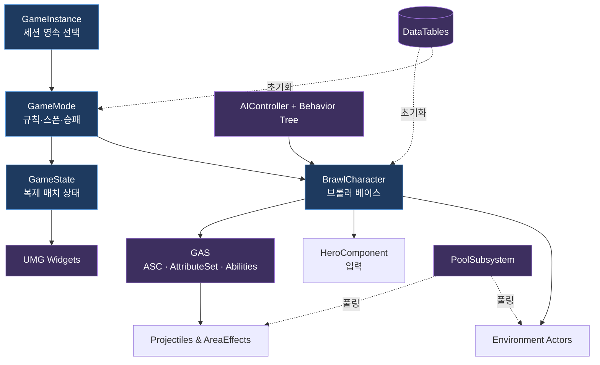

# BrawlStarsTPS


모바일 탑다운 슈팅 게임 **브롤스타즈**를 3인칭 슈팅(TPS)으로 재해석한 언리얼 엔진 5 포트폴리오 프로젝트입니다. 플레이어는 **고도화된 AI 봇**과 경쟁하며 쇼다운·바운티·녹아웃 등 클래식 모드를 플레이합니다.

> **Technical Focus** — Lyra 스타일 모듈러 아키텍처(GAS·컴포넌트 기반), AI 주도 게임플레이(Behavior Tree), 그리고 실무 수준의 런타임 최적화(오브젝트 풀링)를 C++로 구현하는 것을 목표로 합니다.

## ✨ 주요 특징

| 영역 | 내용 |
|------|------|
| **고성능 아키텍처** | `IBrawlPoolableInterface` + `UBrawlPoolSubsystem` 기반 범용 오브젝트 풀링, 재귀적 프리워밍으로 런타임 GC 부하 최소화 |
| **GAS 전투 시스템** | `AttributeSet`·`GameplayAbility`로 체력/탄약/슈퍼/하이퍼/가젯을 데이터 주도로 모델링, Anti-Tunneling 정밀 투사체 판정 |
| **확장 가능한 게임 모드** | `ABrawlStarsTPSGameMode` 베이스에 포이즌 존·팀 스폰·AI 스폰 공통 로직 집약, 최소 오버라이드로 모드 추가 |
| **전략 기반 AI** | Behavior Tree + Blackboard, `BTS_EvaluateStrategy`가 상황을 평가해 순찰/이동/교전/도주 전략을 산출 |
| **환경 상호작용** | 수풀(Bush) 은신·투명화, 지형 파괴 시 물리 기반 파워 큐브 드롭 |
| **그래픽 완성도** | NVIDIA DLSS 통합, Slate 기반 심리스 로딩 화면 |

자세한 기술 설명은 [PORTFOLIO_HIGHLIGHTS.md](PORTFOLIO_HIGHLIGHTS.md)를 참고하세요.

## 🏗️ 아키텍처 개요



기능 모듈별 상세 클래스 다이어그램은 **[Docs/ClassDiagrams/](Docs/ClassDiagrams/00_Overview.md)** 에 정리되어 있습니다.

## 📂 프로젝트 구조

```
BrawlStarsTPS/
├─ Source/BrawlStarsTPS/
│  ├─ Public/Private/          # Brawl* 코어 코드 (약 90개 클래스)
│  │  ├─ Abilities/            # GAS 어빌리티 계층 (Fire/Super/Hyper/Gadget/...)
│  │  ├─ AI/                   # AIController + Behavior Tree 노드
│  │  ├─ Components/           # HeroComponent, MatchFlowComponent
│  │  ├─ Environment/          # Obstacle/Bush/PoisonZone/PowerCube
│  │  ├─ GameMode/             # Showdown/Bounty/Knockout/Lobby
│  │  ├─ Projectiles/          # 발사체 계층
│  │  ├─ UI/                   # UMG 위젯
│  │  └─ Data/                 # DataTable 행 구조체 · Enum
│  └─ Variant_*/               # Epic TPS 템플릿 변형 (참고용)
├─ Content/                    # 에셋 (블루프린트·머티리얼·맵)
├─ Config/                     # DefaultEngine/Input/Game.ini
└─ Docs/                       # 문서 (클래스 다이어그램·템플릿)
```

핵심 파일 경로는 [KEY_FILE_PATHS.md](KEY_FILE_PATHS.md)에 정리되어 있습니다.

## 🎮 게임 모드

| 모드 | 설명 |
|------|------|
| **Showdown (쇼다운)** | 생존 배틀로얄. 파워 큐브 수집, 포이즌 존 축소 |
| **Bounty (바운티)** | 팀 처치 점수 경쟁, 타이 브레이커 시스템 |
| **Knockout (녹아웃)** | 라운드제 팀 전멸전 (3선 2승) |

## 🛠 Tech Stack

- **Engine**: Unreal Engine 5 (5.7)
- **Language**: C++ (코어 로직), Blueprint (UI · 데이터)
- **Core Systems**: GAS, World Subsystem, Enhanced Input, Behavior Tree/AI, Object Pooling, Slate UI, NVIDIA DLSS

## 📖 문서

- [PORTFOLIO_HIGHLIGHTS.md](PORTFOLIO_HIGHLIGHTS.md) — 기술적 특징 및 아키텍처 요약
- [PORTFOLIO_MILESTONES.md](PORTFOLIO_MILESTONES.md) — 개발 마일스톤 및 진행 현황
- [KEY_FILE_PATHS.md](KEY_FILE_PATHS.md) — 주요 파일 경로 인덱스
- [Docs/ClassDiagrams/](Docs/ClassDiagrams/00_Overview.md) — 기능 모듈별 클래스 다이어그램

## 📸 스크린샷


## 📜 License

[MIT License](LICENSE) © 2026 ThunderVolt45

> 본 프로젝트는 학습 및 포트폴리오 목적으로 제작되었으며, '브롤스타즈'의 지식재산권은 Supercell에 있습니다.
